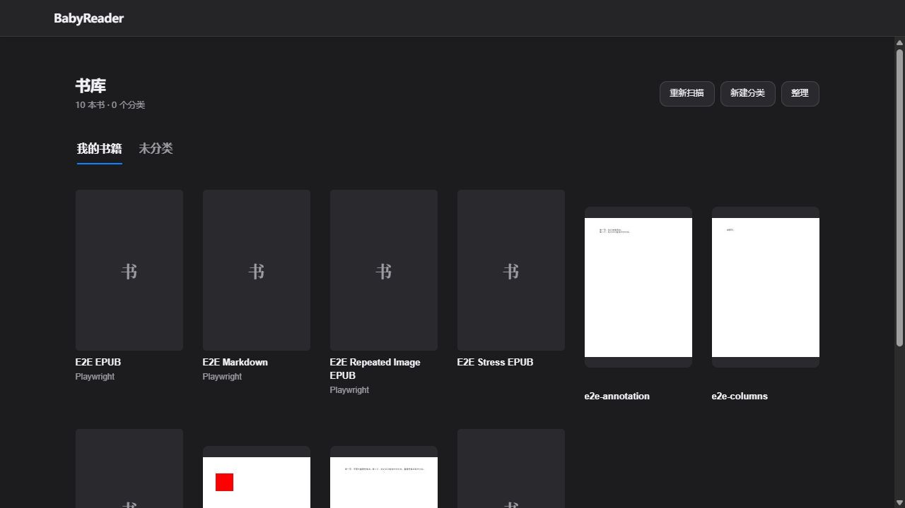
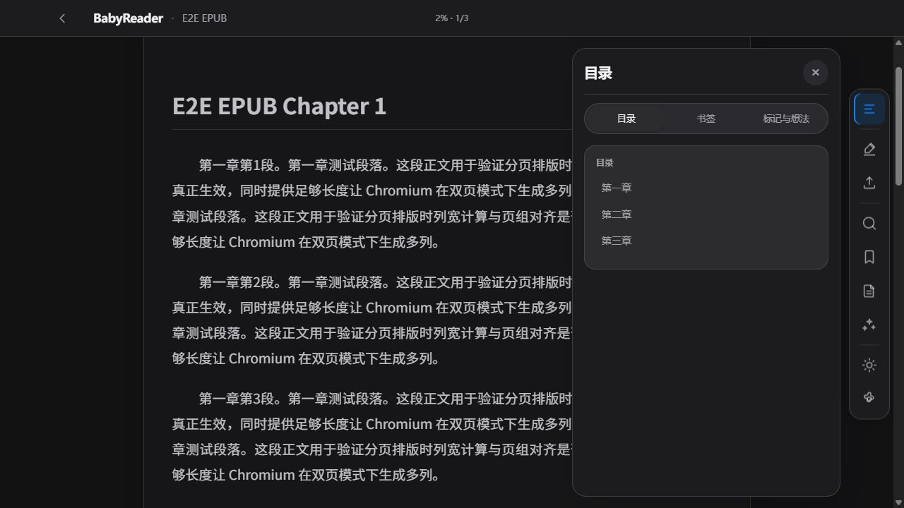
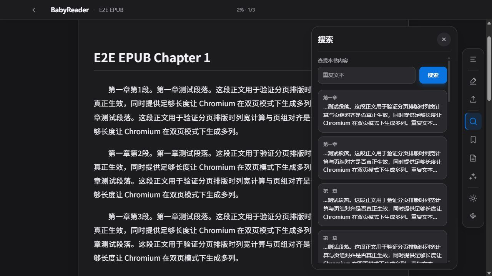
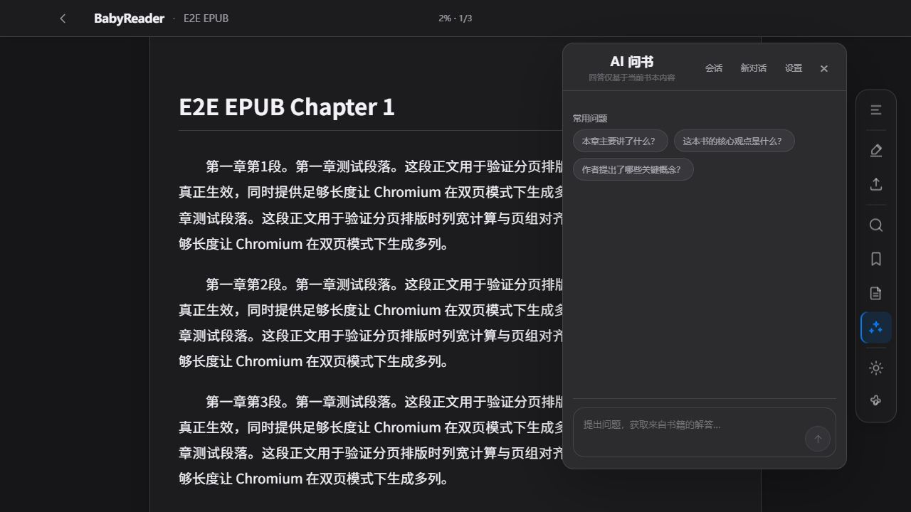
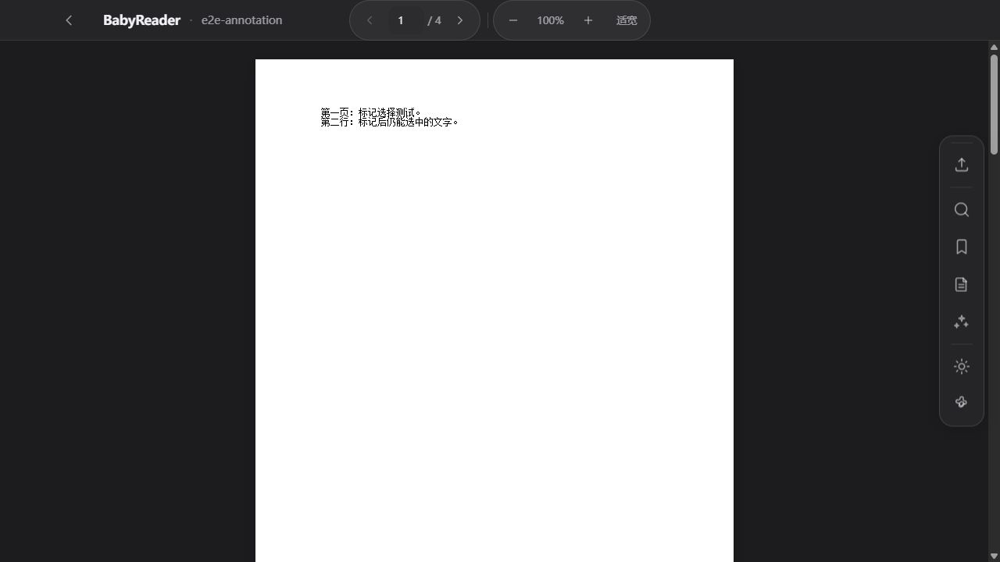
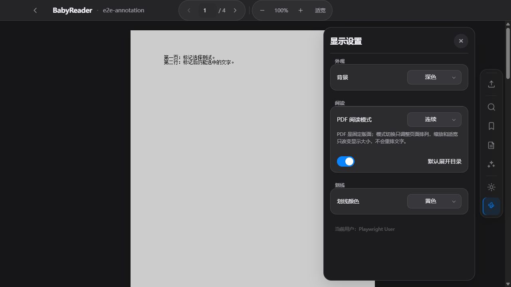
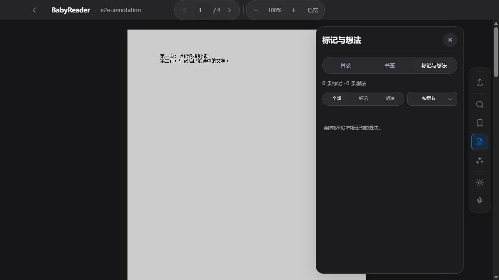
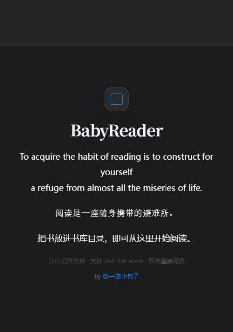

# BabyReader 日常阅读体验与交互细节优化计划

日期：2026-09-28。状态：**规划已完成，当前工作区已开始分阶段实施**。实施进度、验证范围与未完成项见 [执行记录](../progress/2026-09-28-reading-experience-interaction-progress.md)。

本计划任务使用 **UX Task 0–8** 编号，独立于 PDF 结构化 AI、PDF/EPUB 对齐和早期 PDF Task 编号。不得把本文的建议视为已实现功能或设备验收结果。

## 1. 审查结论与范围

当前产品已有完整的书库、阅读、搜索、书签、标注、导出和 AI 路径。主要问题不在“缺少更多功能”，而在同一操作的状态、退出、保存、焦点和反馈不一致：用户很难判断刚才的动作有没有完成、关闭面板会不会丢内容、出了错应该从哪里恢复。

优化目标：读者可以自然完成“找到书 → 接着读 → 查原文 → 做笔记 → 询问 AI → 回到原来的位置”，尽量不需要理解索引、渲染器、网络请求或不同格式的内部实现。

规划阶段采用 Product Design audit 流程，将真实页面截图和操作观察与源代码证据分开记录。下文「本次」仅指最初的审查与规划阶段；后续实施另记于执行记录，不把最初基线描述当成当前代码状态。

### 1.1 基线与证据限制

- 源码基线：当前工作区，HEAD `578785f`，已有大量未提交内容，**不以 HEAD 单独代表本次运行版本**。
- NAS 当前标签页：带 PDF book 参数，但刷新后仍显示欢迎页。没有明确错误，也没有可操作的书库入口。根因尚未定位，不能据此断言 NAS 扫描或 PDF 服务坏了。
- 为继续核实交互，运行现有 `e2e/start-server.js`，使用独立 `.runtime/ux-audit-20260928-01` 合成书库；只在本地进程启用现有 PDF 与分类开关。没有使用真实书籍或配置 AI 供应商。
- 本地浏览器实际截图为 1280×720；NAS 原标签页截图为其当时视口。未把两者当成相同环境比较，未做完整手机/竖屏/主题矩阵。
- 未发送 AI 问题、未删除用户数据、未改 NAS 配置。笔记未保存、删除恢复、断网退出、流式回答的部分风险来自代码审查，需在未来 Task 中复现。
- 本次不是回归测试完成报告，也不声称完成 WCAG 合规检查。
- 用户之前暂缓的长文档资源/内存压力验收、全套 Task 10 无障碍和设备适配仍暂缓；这里仅纳入日常键盘操作、焦点和现有面板的必要修正。

### 1.2 当前值得保留的实现

1. EPUB/PDF 已共享目录、搜索、笔记和 AI 外壳；PDF 页坐标与 EPUB 语义位置各自处理，方向正确。
2. 搜索已支持分页加载、继续加载失败重试、书籍/请求代次保护；跳转结果时保持搜索面板。
3. PDF 缺文本、来源过期、无法精确定位已有部分明确降级文案；不能为视觉统一而隐藏这些真实限制。
4. 标注写入有异步错误处理；PDF 笔记导出有防重复与切书保护；AI 输入已防中文输入法确认误发送。
5. 已有主题语义色、圆角、间距和 reduced-motion 基础。继续收敛现有 token，不引入第二套设计系统。

## 2. 本次页面观察记录

| 步骤 | 操作/页面 | 评价与证据 |
| --- | --- | --- |
| 01 | 打开 NAS 当前 PDF 标签页并刷新一次 | 受阻：仅欢迎页，无恢复入口；不能完成 NAS 流程审查 |
| 02 | 打开本地合成书库 | 可用：分类导航清楚；没有书名查找、继续阅读或格式提示；混合卡片的标题起始位置不齐 |
| 03 | 单击 EPUB，观察默认目录，再关闭目录 | 可用但打断：打开书即展示目录；关闭后工具按钮仍叫“隐藏目录”，与实际状态相反 |
| 04 | 打开搜索，搜索“重复文本”，关闭再打开 | 已复现：初始焦点在关闭按钮；关闭再打开查询为空；结果摘要缺少关键词强调 |
| 05 | 打开未配置的 AI 面板，按 Esc | 已复现：输入禁用却无配置提示；Esc 不关闭主面板；没有调用模型 |
| 06 | 返回书库，打开合成 PDF | 可用：PDF 翻页/缩放组合清楚；返回书库时焦点回到页面根部，顶部仍保留上一书名 |
| 07 | 打开 PDF 显示设置，再关闭 | 可用：固定版面说明准确；颜色设置远离选区任务；说明文字、分组与控件可进一步精简 |
| 08 | 打开 PDF 笔记空列表，按左方向键切换标签 | 已复现：界面显示“按章节”，底层选项为“按页”；方向键未切换标签；空态没有下一步指引 |

### 02 书库

### 03 EPUB 默认目录

### 04 搜索

### 05 AI 未配置

### 06 PDF 阅读

### 07 PDF 设置

### 08 PDF 笔记

### 01 NAS 访问限制证据

## 3. 问题清单：原因、影响和优化方向

优先级：P1 为任务中断、容易误操作或潜在内容丢失；P2 为高频操作负担；P3 为视觉和长尾完善。没有将未复现风险直接定为线上故障。

| ID / 优先级 | 证据与原因 | 对日常使用的影响 | 建议 |
| --- | --- | --- | --- |
| UX01 / P1 | `app.js:307` 启动的三个请求采用 `Promise.all`；失败仅转 `showHighlightHint`。`actions.js:288`、`:308` 将大多数提示写入书名，1.6 秒后还原。NAS 仅欢迎页是观察事实，具体原因待查 | 会话失效、加载失败与空书库难以区分；用户可能误以为“没扫描到” | 明确加载/空库/登录失效/服务失败状态，持久显示下一步与重试；成功轻提示，失败就地保留 |
| UX02 / P1 | `ai.js:1284` 写未配置提示；`:1690` 随后恢复会话；`:944` 清掉状态。步骤05已复现 | AI 输入不能用，却没有说明为什么 | 配置状态、会话状态、回答状态分开；未配置展示“配置 AI 服务”入口，不被会话加载覆盖 |
| UX03 / P1 | `highlights.js:499` 关闭直接清理编辑会话；`:727` 关闭、`:731` Esc 都未检查脏内容。保存函数没有统一提交中锁 | 输入长想法后误关闭可能丢草稿；慢请求时重复点击有重复操作风险 | 编辑器脏状态与内存草稿；关闭有改动时选择继续编辑/放弃；保存中防重复，失败保留文本 |
| UX04 / P1 | `notes-panel.js:406` 和 `highlights.js:680` 删除立即调用接口，无撤销；`organization.js:760` 分类删除也直接执行。`server/index.js:1184` 分类删除仅移除分类关系并回未分类 | 容易误删标注/想法；不知道删分类是否删书 | 优先使用范围明确的确认和影响文案；标注删除需可恢复设计。未证明恢复接口完整前，不显示“撤销” |
| UX05 / P1 | `lifecycle.js:7` PDF 保存失败只记控制台，`:11` 先销毁阅读器，之后再 flush/读取书库；后续失败会落入 catch。`navigation.js:17` Ctrl/Cmd+O 直接渲染书库绕过该链路 | 断网返回可能失去可用阅读面；不同返回入口保存语义不一 | 先捕获位置/完成必要保存、准备目标面，再完成切换和销毁；失败保留阅读面并提供重试。所有返回入口走同一契约 |
| UX06 / P1 | `ai.js:1787` 全局 Esc 无条件 preventDefault，却只关 AI 子面板；`drawer.js:337`、`highlights.js:730` 各自处理 Esc。步骤05主 AI Esc 无效 | 退出逻辑难以预测，嵌套面板可能一键关闭多层 | 顶层面板优先消费 Esc；按一次只处理最上层；脏编辑器先保护草稿 |
| UX07 / P1 | `notes-panel.js:423` 对来自整张笔记卡的 Enter/空格直接导航，未排除卡内编辑/删除按钮；卡片 role=button 又嵌套 button | 键盘激活子按钮可能变成跳原文 | 卡片主体定位与操作按钮分离；仅主体消费导航键，原生按钮自行处理激活 |
| UX08 / P2 | `drawer.js:207` 初始焦点用首个可聚焦元素；搜索首项是关闭。`:238` 关闭搜索调用 `resetReaderSearch`，`search.js:527` 清空全部状态。步骤04复现 | 搜索前多点一次，查看正文后又要重新输入 | 初次搜索聚焦输入；同书关闭仅隐藏，保留词、结果、滚动和当前命中；切书清理 |
| UX09 / P2 | `search.js:282` 摘要直接 textContent；没有活动结果编号；`:205` 和 `:445` 命中框只显示1.8秒 | 相似摘要难区分，眼睛还没移到正文高亮就消失 | 摘要安全强调关键词；显示已加载数量而非伪造总数；活动结果选中态、上一/下一命中；高亮保留到下一次导航/搜索结束或使用更温和淡出 |
| UX10 / P2 | `organization.js:349` 排序仅整理模式，书卡禁用，鼠标只能拖手柄；分类可拖文字。`:294` 鼠标立即激活；只有目标高亮，未形成连续插入预览 | 相同对象拖动方式不一致，不容易知道释放后落在哪里 | 桌面小手柄可发现、移动阈值后激活；分类/书籍一致的插入线和取消反馈；手机保留长按。整理作为批量操作入口，避免为单次排序多一步 |
| UX11 / P2 | `organization.js:439` 添加书籍无搜索、多选；`:499` 每加一本重建书库再打开选择器；服务端为单分类归属 | 多本加入时列表和焦点丢失；“加入”可能实际上从其他分类移出 | 可查找、多选、保留列表滚动；明确“移入分类”及原分类；复用 revision 写入逐项汇报，不并发用同一旧 revision |
| UX12 / P2 | `view.js:12` 有扫描摘要，但分类版 `organization.js:160` 成功后只重渲染，无同等结果说明；根目录错误也未分层展示 | 扫描结束书数不变时不知道是重复文件、授权失败还是未发现 | 两种书库共用扫描状态，显示新增/未读取/无变化；失败给下一步；详情折叠，避免暴露服务器路径 |
| UX13 / P2 | `organization.js:24` 书卡仅封面/标题/作者；没有书名筛选；`core/api.js:109` 重命名 API 已有但 UI 无入口 | 库大后找书慢，分类起错名只能删建 | 添加本地书名/作者筛选、继续阅读入口与轻量格式标识；分类更多菜单提供重命名；不改用户手动排序默认值 |
| UX14 / P2 | `_lastLibraryFocusBookId` 仅在 `highlights.js:74` 声明、`lifecycle.js:36` 赋值；无消费处。步骤06返回焦点根部且残留书名 | 看完返回后要重新找刚才的书，顶部信息又像仍在阅读 | 返回恢复原分类/列表位置/卡片焦点；书库顶部清理阅读书名；分类标签、浏览器返回与阅读返回行为统一 |
| UX15 / P2 | `ai.js:1643` 关闭等于停止；`:1411` PDF delta 只累计文本，核验后展示；`:1092` 每次 render 总滚到底 | 收起面板意外中断回答；核验等待像空白；翻看上文会被拉走 | 区分收起和停止；提供生成/核验占位和耗时状态；只在接近底部时跟随；保留 PDF 引用核验后展示边界 |
| UX16 / P2 | `highlights.js:143` 根据默认目录偏好生成“隐藏/显示”标签，而 `drawer.js` 控制真实展开状态；步骤03复现。`state.js:22` 默认展开 | 实际关闭仍提示隐藏；打开书先被目录遮住 | 标签由当前 surface 状态决定；新用户默认先展示正文可作为后续选择，已有目录偏好不改 |
| UX17 / P2 | `notes-panel.js:364` 只修改原生 option 为“按页”；`settings.js:248` 初始化时复制选项；后续不同步显示文字。步骤08复现 | PDF 仍看到按章节，影响理解与信任 | 自定义 select 更新必须包含 value、label、options、disabled 和语义状态，而非只修改隐藏的原生控件 |
| UX18 / P2 | 内容面板和笔记筛选 `role=tab`，非活动项 tabindex=-1，事件仅处理点击；步骤08方向键无效。搜索无遮罩但统一 aria-modal=true/Tab循环 | 键盘无法自然到达其他标签；可阅读正文与模态语义相矛盾 | 正确的标签方向键；明确阅读侧面板为非模态、需要决策的弹窗为模态，行为/ARIA/遮罩一致 |
| UX19 / P3 | `styles.css` 并存 `--color-*`、`--ui-*`、`--library-*`；`:1902` 选区菜单独立暗色；`:2195` 使用未统一的 danger fallback；`:2569` 清掉书卡焦点轮廓 | 控件外观像来自不同模块，焦点与禁用状态易混淆 | 先审计实际计算样式，再合并控件 token；明确中性色/强调色/危险色，保留可辨识焦点 |
| UX20 / P3 | `index.html:446` 欢迎提示仍“⌘O、.md/.txt/.epub、双击”，书卡实际单击；Ctrl/Cmd+O 实际回书库。步骤08笔记空态仅宣告没有内容 | 新用户学到错误操作，空态没有下一步 | 按真实平台与能力写文案；统一“书库/书架”“标注/标记/批注”；空态给简单动作提示；“护眼米黄”改中性主题名，避免功效暗示 |

> 代码行号仅用于本次快照定位；实施前按函数名复核。视觉建议不得把源文件出现的单条 CSS 当作最终计算样式，尤其要检查末尾覆盖规则。

## 4. 统一交互契约

### 4.1 书库与返回

- 保留当前用户选定的“我的书籍 → 分类名 → 未分类”同级横向导航，不恢复底部分类板块或“我的分类/按目录”。
- 单击书卡阅读；拖动超过阈值才排序；操作完成保留书卡位置。建议桌面鼠标位移阈值先以 6px 验证，触屏沿用已有350ms长按作为基线，不能仅凭感觉缩短。
- 分类是当前已有的单归属模型；所有文案说明移动，不能把 UI 改成多标签却继续复用单归属存储。
- 返回书库恢复原分类、筛选词、滚动位置和原书卡焦点。用户主动点“我的书籍”才切回总库。
- 扫描不清空现有书架，不重置整理中的选择。书库排序保持用户手动顺序，“最近阅读”单独入口而非悄悄重排。

### 4.2 面板、焦点与通知

- 桌面目录/搜索/笔记/AI 默认为可与阅读共存的侧面板：打开时聚焦任务入口，关闭回触发控件，允许主动回正文；位置不足时沿用现有适配基础，不在本任务重做全部设备布局。
- 设置可保持现有轻弹层；编辑笔记和删除确认使用真正模态。只最上层处理 Esc，后续不能再被其他全局监听器消费。
- 搜索首次打开聚焦搜索框；AI 可输入时聚焦问题框，不可用时聚焦配置动作；笔记编辑聚焦想法文本。
- 成功提示约2–3秒，且不替换书名；失败/未保存状态留在任务区域，带重试；无须每次成功弹阻断框。
- 正在保存时明确状态，避免重复提交；未保存草稿不得因切面板被无声丢弃。

### 4.3 搜索、标注与 AI

- 搜索输入支持 Enter，保留中文输入法行为；不自动对每个输入字符触发索引构建。
- 同书关闭搜索保留上下文；结果点击保留面板；精确命中失败说明“已到页/章”，不伪装精确定位。
- 选区菜单仍用熟悉的复制、马克笔、波浪线、直线、写想法、问 AI。颜色用当前色小圆点就近展开四色，设置继续作为默认偏好入口；选色不得触发 EPUB 重排或丢 PDF 选区。
- 笔记空态：“选中文字后，可划线或写想法”；列表无筛选结果与本书无笔记分开说明；导出可从笔记面板发现，保留原快捷入口。
- AI 收起保留当前书会话和请求；“停止”才取消。切书/返回书库仍按现有安全边界取消，避免后台跨书显示。
- AI 配置问题、会话恢复问题、回答问题分开显示；失败保留问题草稿和重试入口。避免在摘要 UI 展示内部模型 token/索引实现细节。
- PDF 回答维持页码核验后显示，等待期间有明确占位；不为“更快看见字”展示未经核实来源的正式答案。

### 4.4 视觉公约数

目标是清楚、克制和一致，不增加新的玻璃装饰。

| 元素 | 统一方向 |
| --- | --- |
| 顶栏 | 返回、当前书名、阅读位置各司其职；书名截断有完整标题提示；反馈不占用书名 |
| 常用按钮 | 保留现有系统蓝强调色和中性灰次操作；危险色只用于删除，禁用与次要按钮视觉有区别 |
| 图标 | 沿用24 viewBox、1.8线宽、圆端点；统一光学尺寸与居中；可见图标和点击热区分开设计 |
| 控件 | 常见桌面控件建议36–40px，粗指针热区44px；这是项目目标，不冒称所有平台统一强制标准 |
| 面板 | 标题、关闭位置、分组间距和圆角一致；减少“容器内再套大卡片”的层数 |
| 文本 | UI 系统无衬线，正文按既有阅读设置；正文/标签/辅助信息层级明确，低透明度仅用于真禁用信息 |
| 列表 | 封面占位高度稳定，书名和元信息基线统一；更新单行尽量不重建整个列表 |
| 动效 | 复用现有160–240ms等级；避免搜索/保存引起内容位移；尊重已有 reduced-motion |

依据：[Apple Feedback](https://developer.apple.com/design/human-interface-guidelines/feedback) 强调反馈与任务上下文相适应；[Undo and redo](https://developer.apple.com/design/human-interface-guidelines/undo-and-redo) 强调可逆操作；[Toolbars](https://developer.apple.com/design/human-interface-guidelines/toolbars) 用于操作组织参考。Web 键盘和面板语义参考 [WAI-ARIA Tabs](https://www.w3.org/WAI/ARIA/apg/patterns/tabs/)、[Modal dialog](https://www.w3.org/WAI/ARIA/apg/patterns/dialog-modal/)、[Keyboard interface](https://www.w3.org/WAI/ARIA/apg/practices/keyboard-interface/)。本文尺寸、阶段和默认值为项目建议，不是逐条照搬原生 Apple 规范。

## 5. 分阶段实施计划

以下复选框是最初的实施清单；实际完成程度以执行记录和测试证据为准，不因功能已写入就推定 NAS 验收完成。

### UX Task 0：冻结现状、补齐复现证据

涉及：本计划、未来新建同名 progress 文档、现有相关测试；不改运行逻辑。

- [ ] 记录当前文件状态/构建来源，保留已有未提交改动。
- [ ] 将 UX01–20 标成“现场复现/代码确认/待验证”，记录预期与当前行为。
- [ ] 在隔离合成库复现未保存笔记关闭、重复保存、断网返回、键盘子按钮冲突；仅为这些有具体风险的路径补测试。
- [ ] 记录 NAS 欢迎页原因与版本，不将本地通过替代 NAS 通过；若仍不可访问，单独保留部署诊断项。
- [ ] 建立任务验收表，关联现有 `e2e/reader.spec.js`、`search.spec.js`、`highlights.spec.js`、`pdf-reader.spec.js`、`library-organization-live.spec.js`。

完成标准：每项高优先级都有可重复步骤，基线失败不被新改动掩盖。

### UX Task 1：启动、保存与失败反馈可靠化

对应：UX01、UX05、UX12、UX14；文件：`app.js`、`reader/actions.js`、`reader/lifecycle.js`、`reader/navigation.js`、`library/view.js`、`library/organization.js`，必要时调整通知容器 HTML/CSS。

- [ ] 统一启动状态及持久错误区；会话失败先恢复登录，不将其显示成空库。
- [ ] 将通用反馈从书名分离，保存失败可重试；不要只写 console 或短闪提示。
- [ ] 返回书库先完成必需的保存和目标数据准备，失败保持原文可读，后成功切换再销毁旧阅读器。
- [ ] 所有返回路径共用生命周期，恢复分类/书卡焦点和滚动，清掉残留书名。
- [ ] 两种书库共用扫描摘要，空扫描与失败分开；不要改扫描 API、授权校验或自动重建全部索引。

验收：人为让 user-state、library、progress 请求分别失败；每次有准确文案和恢复动作；重试后无双重写入、无重复书、正文不白屏。无网络故障时不增加多余确认。

### UX Task 2：统一面板与键盘消费规则

对应：UX06、UX07、UX16、UX18；文件：`shell/drawer.js`、`reader/ai.js`、`reader/highlights.js`、`reader/notes-panel.js`、`reader/settings.js`、`index.html`。

- [ ] 明确同一时刻最上层交互对象，统一 Esc/返回焦点；避免多个 document listener 同时消费。
- [ ] AI 主面板可 Esc 收起；带草稿编辑器遵循 Task 5 的保护协议。
- [ ] 初始焦点按任务指定；目录标签基于真实展开状态。
- [ ] 修正笔记卡内按钮与整卡导航的键盘冲突。
- [ ] 内容标签与筛选标签支持方向键/Home/End及正确 tabindex；非模态面板取消不匹配的焦点陷阱，真模态保持约束。

验收：仅键盘完成打开、切标签、搜索、编辑、取消、回正文；一次 Esc 只关闭一层；鼠标行为不退化。此处不扩展到完整读屏认证或全设备测试。

### UX Task 3：书库查找与整理流程

对应：UX10、UX11、UX13；文件：`library/organization.js`、`library/reorder.js`、`library/view.js`、`styles.css`，复用现有 `core/api.js`。

- [ ] 添加书名/作者本地筛选，保留手动顺序；从已有可用进度数据展示继续阅读，不为书卡逐本请求全文状态。
- [ ] 桌面拖动入口可发现，点击与拖动分离；插入预览、越界取消、保存失败回滚清楚；触屏保持长按基线。
- [ ] 分类更多菜单支持重命名/删除，解释删除分类后书籍留在未分类；不加入多层分类。
- [ ] 加书选择器支持查找和多选，保留滚动与焦点；单分类移动说明准确。
- [ ] 先复用串行 revision API，标记逐项成功/失败；不得虚构原子批量成功，新增批量接口需另审协议。

验收：1/20/100本合成列表下能快速找到书、移动多本、取消拖动；冲突回滚不丢原序；标签横向溢出可达；返回阅读位置不受整理影响。

### UX Task 4：搜索往返与定位可读性

对应：UX08、UX09；文件：`reader/search.js`、`shell/drawer.js`、相关 HTML/CSS。

- [ ] 区分 hide 与 reset；同书保留查询、游标、结果列表、滚动和活动结果，切书取消旧请求并重置。
- [ ] 搜索打开聚焦输入框；已在结果浏览时返回可恢复原焦点。
- [ ] 安全强调摘要关键词、显示已加载数量和活动命中；不将分页结果数当全书总命中数。
- [ ] 提供前后命中浏览，并定义到达已加载末项时的继续加载行为；保持准确的降级定位提示。
- [ ] 调整命中可见时长或持续显示规则；结果仍不触发面板关闭。

验收：EPUB/PDF各完成搜索→命中→收起→再打开→加载更多→下一命中；网络错误后保留已加载结果；不同书结果不串用；选中文本与持久标注不被搜索覆盖层阻断。

### UX Task 5：笔记草稿、颜色和删除保护

对应：UX03、UX04、UX07、UX17；文件：`reader/highlights.js`、`reader/selection-menu.js`、`reader/notes-panel.js`、`reader/settings.js`、`reader/annotations.js`、HTML/CSS。

- [ ] 用 `bookId + annotationId/selectionSession` 管理脏状态和临时草稿；保存前保留引用定位，取消不写服务器。
- [ ] 保存中禁用重复提交；失败编辑器保持打开且保留输入；关闭脏编辑器使用统一确认。
- [ ] 选区菜单显示当前色与四色选项，更新既有偏好，维持选区锚点。
- [ ] 先补删除影响确认；若推进撤销，先确定旧ID、来源指纹、版本冲突、失败恢复契约，覆盖完整记录后再接 UI。
- [ ] PDF“按页”与 EPUB“按章节”同步至自定义下拉框，切格式后无旧 label/options；空态区分无笔记和筛选无结果。
- [ ] 笔记面板可发现导出动作；统一下载反馈，明确现有 EPUB 导出附带复制剪贴板行为是否保留，避免悄悄覆盖用户剪贴板。

验收：写长想法后 Esc/关闭/切面板不会无声丢失；保存失败恢复；保存连点只产生一次写入；PDF选色无页面重排；不同格式导出继续正确。

### UX Task 6：AI 任务状态与日常对话体验

对应：UX02、UX15；文件：`reader/ai.js`、`index.html`、`styles.css`，原则上不改服务端检索和模型调用。

- [ ] 拆分配置状态/会话恢复/回答阶段；无配置有可见入口，恢复成功不清掉不可用原因。
- [ ] 关闭主面板改为收起：当前书请求可继续，重新打开显示结果；停止按钮显式取消；切书/退出书库维持取消隔离。
- [ ] 问题草稿和可重试失败项保留；用户主动阅读旧消息时不强制拉底，提供“有新回答”入口。
- [ ] PDF以检索、生成、引用核验占位解释等待；仅核验完成才呈现正式回答。
- [ ] 不新增模型调用、自动重试付费请求或默认扩大送出的原文；PDF结构化 AI 开关保持当前状态。

验收：仅用合成 PDF/EPUB 和模拟服务，覆盖未配置、恢复失败、慢首字、无正文、取消、收起再开、切书旧响应；确认无重复请求、无错误来源引用和跨书混入。

### UX Task 7：视觉、组件状态与文案收敛

对应：UX19、UX20及前面任务的表现层；文件：`styles.css`、`index.html`和各视图文案。

- [ ] 建立常规/悬停/按下/焦点/加载/禁用/危险控件清单；以现有 EPUB 风格和蓝灰体系为基线。
- [ ] 检查实际样式优先级，统一按钮、输入、下拉、面板关闭控件；逐模块收敛，不在 stylesheet 末尾继续堆覆盖。
- [ ] 调整书卡封面槽、标题基线、混合格式标识和长标题提示；不拉伸 PDF 封面原比例。
- [ ] 图标线宽/光学居中/热区统一；重点信息不使用接近不可见的文字灰度。
- [ ] 统一术语，纠正欢迎页快捷键/格式/单击说明；无目录、无可提取文本、无笔记分别给准确下一步。

验收：对所改控件做同尺寸前后截图，核对已有浅/深/米色样式；正常、忙碌、失败状态可区分；不改变正文分页几何、PDF缩放或文本层颜色。

### UX Task 8：流程验收与交付记录

- [ ] 完成下面的日常任务矩阵；复用已有测试，只给新增行为和高风险边界补回归。
- [ ] 标明代码验证、本地浏览器、NAS人工验收三种状态；没有证据不得记全部通过。
- [ ] 每阶段记录实际修改文件、证据、剩余风险、回退方法，更新本计划勾选状态。
- [ ] 用户另外要求打包时，再生成 FPK 并核对构建来源；安装、默认开实验功能、删除旧包不属于本规划实施范围。

## 6. 验收矩阵与阶段顺序

| 日常任务 | 必须满足的结果 |
| --- | --- |
| 首次进入 / 会话过期 / 服务失联 | 加载、空库、会话错误分开；有一个清楚的下一步，无死欢迎页 |
| 找书、打开、返回 | 单击阅读；返回原分类/原卡片；书库顶部没有旧书名 |
| 新建、重命名、移动分类 | 归属含义清楚；失败不假成功；不修改磁盘书籍 |
| 拖动与点击 | 桌面点击不误拖，拖动不误开书；长按可取消；保存冲突恢复原序 |
| 搜索往返 | 原词、结果、滚动可恢复；高亮清晰；无法精确定位如实提示 |
| 选区、颜色、想法 | 菜单就地操作；颜色不丢选区、不改页面布局；草稿不静默丢失 |
| 编辑、删除笔记 | Enter激活对应按钮，删除范围明确；保存失败有恢复；撤销仅在确实可恢复时提供 |
| AI未配置与慢响应 | 不出现无说明禁用；等待阶段可理解；收起不误停止，停止不重复发起 |
| 切 EPUB/PDF | 标签/选项/语义随格式正确变化，持久化数据互不污染 |
| 焦点与退出 | Esc只处理最上层，Tab不丢失，任务结束回合理位置 |

建议顺序：Task 0 → 1 → 2 → 3 → 4 → 5 → 6 → 7 → 8。Task 3–6 可逐个发布验收，避免一次引入所有交互变化。若用户更关心笔记内容安全，可将 Task 5 的草稿/删除保护提前到 Task 2 后；颜色与视觉部分仍后置。

## 7. 安全边界与回退

1. 当前只写规划。未来实施保留所有现有未提交工作，不自动提交、合并、清理、安装或修改生产配置。
2. 不改 fnOS 目录授权、鉴权、多用户隔离、同源 Range、CSP、PDF.js版本和资源限额。
3. 不改 EPUB CFI/DOM locator、PDF页索引与quads、来源指纹、旧书签/进度/笔记结构。界面变化不能导致旧数据不可读。
4. 不为 UI 统一重写 EPUB 分页器或 PDF 调度器，不用整体刷新修复局部状态，不改全文索引契约。
5. 分类继续是应用内组织；删除分类不删除书文件；排序不移动磁盘文件。批量操作保持 revision 冲突检测。
6. 搜索隐藏状态缓存只作用于当前书籍会话，切书/退出登录清理；草稿不可跨UID暴露。持久草稿或服务端撤销若需要新schema，单独设计与审核。
7. AI 验收继续使用合成材料和模拟服务；不调用真实供应商，不将真实书籍送出，不自行开启结构化 AI。
8. 每 Task 独立提交差异供审阅（是否真正提交遵循用户指令）；回退该阶段 UI/状态协调变更即可，不能通过删用户状态或降级旧整包回滚。
9. 不把全局字号、选区颜色、通用 `[hidden]`、原生 `::selection` 样式随意改成全局强制规则；这些曾影响 PDF 阅读层与书库显示，应按作用域调整。

## 8. 经验反思

- 功能“接口成功”与用户“知道已成功”是两件事。之前多个能力逐次补齐，反馈却集中借用书名闪烁，导致成功/失败缺少稳定位置。
- DOM 和持久状态之间缺少统一的展示投影会产生小而明显的错乱：目录默认偏好不等于面板展开；原生select的label不等于自定义选项的label。
- 全量重建列表方便实现，但会牺牲焦点、滚动、选择和操作连续性；后续更新优先保留交互上下文。
- 无障碍语义并非加了 role/tabindex 就完成。键盘事件、焦点和实际模态行为必须一并实现；本次按键观察揭示了源码静态断言容易漏掉的问题。
- PDF与EPUB应共享用户操作契约，不共享不适用的定位算法。可复用通知、草稿、动作状态和面板生命周期；不能把页码当章节或把固定页面当流式段落。
- 视觉统一应最后确认布局和状态，再收敛色彩与间距。仅不断改按钮颜色无法解决关闭即丢状态、无解释禁用等根本体验问题。

## 9. 本次完成记录

- [x] 源码与既有规划审查，重点覆盖书库、生命周期、面板、搜索、笔记、设置和 AI。
- [x] 保存并检查8张当次截图，区分NAS受阻页面与本地合成预览。
- [x] 核实搜索焦点/清空、AI未配置提示被覆盖、AI Esc无效、PDF排序文案不同步、标签方向键和返回焦点等行为。
- [x] 写明20项发现、UX Task 0–8、验收与安全边界。
- [ ] 应用代码实施：本次未执行。
- [ ] NAS完整阅读流程验收：本次未完成。
